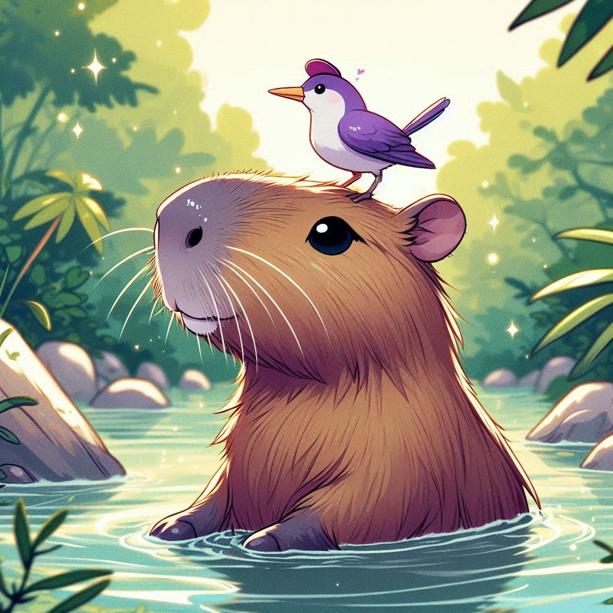

<p align="center">
    
</p>

<p align="center"> Projeto desenvolvido para facilitar a catalogação de capivaras, proporcionando experiência em UX/UI. </p>


## 👩‍💻 Tecnologias utilizadas
⤷ HTML<br>
⤷ CSS<br>
⤷ JavaScript<br>
⤷ SQLite

## 💻 Como executar o projeto
Antes de rodar o projeto, certifique-se de ter o seguinte instalado:

⤷ **Git**: Para clonar o repositório. [Instalar Git](https://git-scm.com/)<br>
⤷ **Node.js** (para rodar o servidor local): [Instalar Node.js](https://nodejs.org/)

## ⚙️ Instalação

Siga os passos abaixo para rodar o projeto localmente:

1. Clone este repositório:
    ```bash
    git clone https://github.com/Ana-Seidel/Capidex.git
    ```

2. Instale o SQLite3:
    ```bash
    npm install sqlite3
    ```

3. Execute o seguinte comando para iniciar o projeto:
    ```bash
    node app.js
    ```

## 🌐 Abrindo o navegador

Abra o arquivo **index.html** em seu navegador para ver o projeto em ação.


<div style="text-align:center;">
    <a href="https://www.linkedin.com/in/ana-luiza-seidel-95a2a61b8/">
        
    </a>
    <a href="mailto:anaafsw1@gmail.com">
        
    </a>
</div>

<br>

<p align="center">
    
</p>


<p align="center">
    ©2024 by Ana Luiza Seidel
</p>